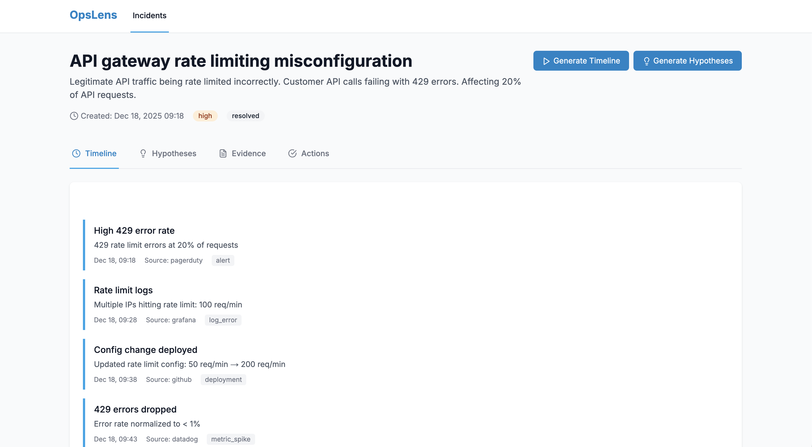
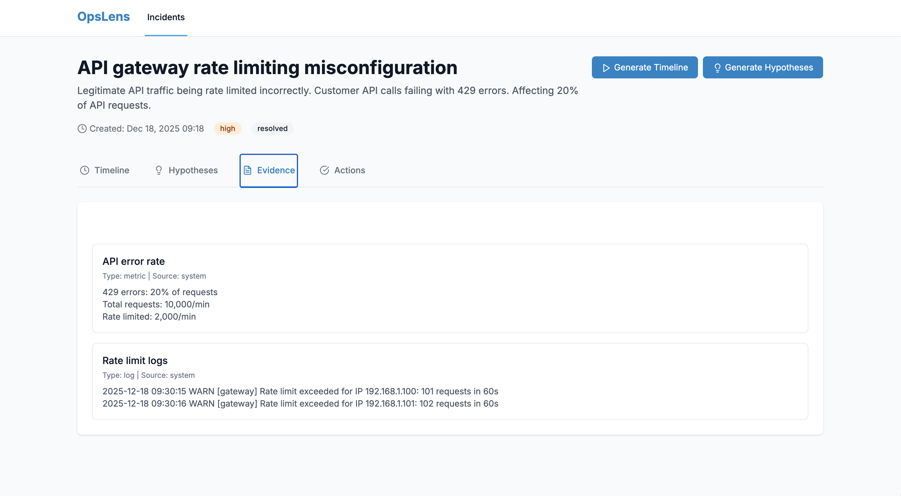

# OpsLens — Multimodal On-Call Copilot

<div align="center">

**An AI-powered incident response system that transforms chaos into clarity**

[](https://www.python.org/)
[](https://fastapi.tiangolo.com/)
[](https://nextjs.org/)
[](https://www.postgresql.org/)
[](LICENSE)

</div>

## What is OpsLens?

Ever been on-call at 2 AM, frantically switching between PagerDuty, Slack, Grafana, GitHub, and your runbooks trying to figure out what's broken? OpsLens is here to help.

It's an AI-powered copilot that pulls together all those scattered signals—alerts, logs, metrics, screenshots, PRs—and turns them into something actually useful: a clear timeline of what happened, AI-generated hypotheses about the root cause, and actionable next steps. Think of it as your incident response co-pilot that never sleeps.

## Screenshots

<div align="center">

### Incident List View

*View all incidents at a glance with severity, status, and timestamps*

### Incident Detail - Timeline

*Chronological timeline showing events from GitHub, PagerDuty, and other sources*

### Incident Detail - Hypotheses

*AI-generated root cause hypotheses ranked by confidence with supporting evidence*

### Incident Detail - Evidence

*All evidence in one place: logs, metrics, screenshots, and their AI analysis*

</div>

## What It Does

When an incident hits, OpsLens:

- **Builds a timeline automatically** - Pulls in events from GitHub (recent deployments), PagerDuty (alerts), and other sources to show you what changed and when
- **Analyzes screenshots with AI** - Upload a dashboard screenshot and it'll tell you what's wrong, what metrics are spiking, and what errors it sees
- **Generates root cause hypotheses** - Uses AI to analyze all the evidence and suggest what might be causing the issue, ranked by confidence
- **Suggests actions** - Gives you concrete next steps: queries to run, who to page, whether to rollback
- **Drafts postmortems** - When it's all over, it'll generate a postmortem draft with root cause analysis and follow-up actions

## Features

### Real Integrations (Not Mock Data)

- **GitHub** - Automatically fetches your recent PR merges and adds them to incident timelines. Works with both personal accounts and organizations.
- **PagerDuty** - Pulls in active incidents and alerts, correlates them with your OpsLens incidents
- **Webhooks** - Accept webhooks from GitHub, PagerDuty, or any custom system to automatically create incidents

See the screenshots above to see the UI in action—the incident list, timeline view, hypotheses, and evidence viewer.

### AI That Actually Works

- **LLM (Llama 3.1)** - Summarizes logs, generates hypotheses, writes postmortems. All via Hugging Face's Inference API, so no need to host massive models yourself.
- **VLM (Qwen2.5-VL)** - Upload a screenshot of your Grafana dashboard and it'll tell you what it sees: errors, anomalies, key metrics. Pretty wild, honestly.
- **RAG (BGE-M3)** - Semantic search over your runbooks and historical postmortems. Ask "how do I fix database connection issues?" and it'll find the relevant runbook.

### Built for Integration

- **REST API** - Full REST API with OpenAPI docs. Create incidents, upload evidence, generate hypotheses—all programmatically
- **API Key Authentication** - Secure your API with API keys. Optional in dev, required in production
- **Webhooks** - Both incoming (GitHub, PagerDuty) and outgoing (notify your systems when incidents are created/updated)
- **Test Endpoints** - Built-in endpoints to test your integrations and verify everything's working

## Quick Start

### Prerequisites

You'll need:
- Docker Desktop (make sure it's running)
- API keys (all free tiers work fine):
  - [Hugging Face](https://huggingface.co/settings/tokens) - for AI models
  - [GitHub](https://github.com/settings/tokens) - Personal Access Token with `repo` scope
  - [PagerDuty](https://support.pagerduty.com/docs/api-keys) - API key from your account

### Installation

1. **Clone it:**
   ```bash
   git clone https://github.com/yourusername/OpsLens.git
   cd OpsLens
   ```

2. **Set up your API keys:**
   ```bash
   cp secrets.env.example secrets.env
   # Open secrets.env and paste your API keys
   ```

3. **Start everything:**
   ```bash
   ./setup.sh
   ```
   
   This will start all the services, initialize the database, and optionally generate some realistic test data.

4. **Open it up:**
   - Frontend: http://localhost:3000
   - API Docs: http://localhost:8000/docs (interactive Swagger UI)
   - Backend: http://localhost:8000

That's it! You should see the frontend with some sample incidents (if you generated synthetic data).

## How to Use It

### View Incidents

Just go to http://localhost:3000. You'll see a list of incidents (like in the first screenshot above). Each incident shows its severity, status, and when it was created. Click on any one to dive into the details.

### Generate a Timeline

On an incident page, click "Generate Timeline" (see the timeline screenshot above). OpsLens will:
- Fetch recent GitHub PR merges (last 24 hours)
- Pull in PagerDuty incidents
- Correlate everything chronologically
- Show you a clean timeline of what happened

The timeline view shows all events in chronological order, making it easy to see what changed and when.

### Analyze a Screenshot

Got a dashboard screenshot? Upload it in the Evidence tab (see the evidence screenshot above). The VLM will analyze it and tell you:
- What errors it sees
- What metrics are spiking
- Any anomalies it notices
- A plain-English description of what's on the dashboard

Processing happens in the background, so give it a few seconds and refresh. The analysis will appear in the evidence content.

### Generate Hypotheses

Click "Generate Hypotheses" (see the hypotheses screenshot above) and the AI will:
- Analyze all the evidence (logs, metrics, screenshots)
- Generate root cause hypotheses
- Rank them by confidence
- Link them to supporting evidence

The hypotheses are ranked by confidence, so you know which ones to investigate first.

### Set Up Webhooks

Want incidents to be created automatically? Set up webhooks:

**GitHub:**
1. Go to your repo → Settings → Webhooks
2. Add webhook: `https://your-domain.com/api/v1/webhooks/github`
3. Select "Pull requests" events

**PagerDuty:**
1. PagerDuty → Integrations → Webhooks
2. Add webhook: `https://your-domain.com/api/v1/webhooks/pagerduty`
3. Select incident events

Now when PRs merge or PagerDuty alerts fire, incidents are created automatically!

## Testing Your Setup

### Test Integrations

```bash
# Test GitHub connection
curl http://localhost:8000/api/v1/integrations/test/github

# Test PagerDuty connection
curl http://localhost:8000/api/v1/integrations/test/pagerduty

# Test everything
curl http://localhost:8000/api/v1/integrations/test/all
```

### Test VLM

```bash
# Check if VLM is ready
curl http://localhost:8000/api/v1/test/vlm/status

# Test with an actual screenshot
curl -X POST http://localhost:8000/api/v1/test/vlm \
  -F "file=@your_screenshot.png"
```

### Test Webhooks

```bash
# Test webhook endpoint
curl http://localhost:8000/api/v1/webhooks/test

# Send a test webhook
curl -X POST http://localhost:8000/api/v1/webhooks/generic \
  -H "Content-Type: application/json" \
  -d '{"title": "Test Incident", "severity": "medium"}'
```

## Project Structure

```
OpsLens/
├── backend/              # FastAPI backend
│   ├── app/
│   │   ├── api/         # REST endpoints (incidents, evidence, webhooks, auth)
│   │   ├── auth/        # Authentication (API keys, JWT)
│   │   ├── db/          # Database models
│   │   ├── integrations/# GitHub, PagerDuty
│   │   ├── services/    # Business logic (ML, RAG, incidents)
│   │   └── workers/    # Celery async tasks
│   └── requirements.txt
├── frontend/            # Next.js frontend
│   ├── app/            # Pages and components
│   └── lib/            # API client, types
└── docker-compose.yml  # All services
```

## Tech Stack

**Backend:**
- FastAPI - Fast, modern Python web framework
- PostgreSQL + pgvector - Database with vector search built-in
- Celery + Redis - Background job processing
- Hugging Face Inference API - AI models without the infrastructure headache

**Frontend:**
- Next.js 14 - React framework
- TypeScript - Type safety
- Tailwind CSS - Styling

**Infrastructure:**
- Docker Compose - Everything containerized
- All services run in containers for easy setup

## API & Authentication

### Using the API

The API is fully documented at http://localhost:8000/docs. You can try endpoints right there.

### Authentication

By default, authentication is **disabled** for easy development. To enable it:

1. Set `ENABLE_AUTH=true` in your config
2. Create an API key:
   ```bash
   curl -X POST http://localhost:8000/api/v1/auth/api-keys \
     -H "Content-Type: application/json" \
     -d '{"name": "My Integration"}'
   ```
3. Use it:
   ```bash
   curl -H "X-API-Key: your-key" \
     http://localhost:8000/api/v1/incidents
   ```

See [API_AUTHENTICATION.md](API_AUTHENTICATION.md) for the full guide.

### Webhooks

OpsLens supports both incoming and outgoing webhooks:

- **Incoming:** GitHub, PagerDuty, or generic webhooks create incidents automatically
- **Outgoing:** OpsLens can notify your systems when incidents are created/updated

Check out [WEBHOOKS.md](WEBHOOKS.md) for setup instructions.

## Development

### Running Locally

```bash
# Start everything
docker-compose up -d

# View logs
docker-compose logs -f backend

# Restart a service
docker-compose restart backend

# Stop everything
docker-compose down
```

### Adding New Integrations

The architecture makes it easy to add new integrations:

1. Create a new file in `backend/app/integrations/`
2. Add test endpoints in `backend/app/api/integrations.py`
3. Wire it into the incident worker
4. Done!

See the GitHub and PagerDuty integrations for examples.

## What's Next?

This is an MVP, but it's fully functional. Here's what's coming:

- **More integrations** - Slack, Datadog, Grafana, OpenTelemetry
- **Better AI** - Fine-tuned models, better hypothesis generation
- **Production features** - RBAC, audit logging, multi-tenant support
- **Evaluation** - Metrics to measure how well the AI is performing

Check the [roadmap section](#roadmap) for more details.

## Troubleshooting

**Services won't start?**
- Make sure Docker Desktop is running
- Check if ports 3000, 8000, 5432, 6379 are free
- Look at logs: `docker-compose logs backend`

**API keys not working?**
- Verify your keys in `secrets.env`
- Test the integration endpoints (see above)
- Check the logs for error messages

**VLM not analyzing screenshots?**
- Make sure your Hugging Face API key is set
- Check the VLM status endpoint
- First request might take 30-60 seconds (model loading)

**Webhooks not working?**
- Verify the webhook URL is accessible
- Check webhook secret matches
- Look at backend logs for incoming webhooks

## Contributing

Found a bug? Have an idea? Pull requests welcome! This is a portfolio project, so contributions that make it more impressive are especially appreciated.

## License

MIT License - do whatever you want with it.

## Documentation

- [API Authentication Guide](API_AUTHENTICATION.md) - Setting up API keys and security
- [Webhooks Guide](WEBHOOKS.md) - Incoming and outgoing webhooks
- [VLM Testing](TEST_VLM.md) - Testing the vision-language model
- [Integration Guide](INTEGRATION_GUIDE.md) - Integrating OpsLens into your systems

## Roadmap

- [x] ~~API key authentication~~ ✅ Done
- [x] ~~Webhook support (incoming & outgoing)~~ ✅ Done
- [x] ~~VLM screenshot analysis~~ ✅ Done
- [x] ~~GitHub & PagerDuty integrations~~ ✅ Done
- [ ] Slack integration (incident threads, notifications)
- [ ] Datadog/Grafana metrics integration
- [ ] OpenTelemetry trace correlation
- [ ] Kubernetes event ingestion
- [ ] Advanced RAG with fine-tuning
- [ ] Evaluation harness for ML models
- [ ] Role-based access control
- [ ] Multi-tenant support

---

**Built for on-call engineers who are tired of context-switching at 2 AM.**
